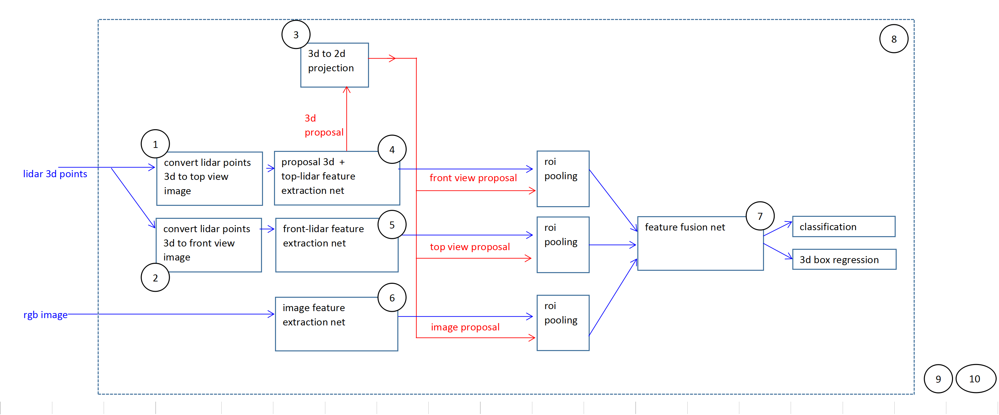

# didi-udacity-2017
Competition entry for didi-udacity 2017 challenge for autonomous driving
you can follow the development process at: [https://medium.com/@hengcherkeng/part-1-didi-udacity-challenge-2017-car-and-pedestrian-detection-using-lidar-and-rgb-fff616fc63e8#.x9mavqle3](https://medium.com/@hengcherkeng/part-1-didi-udacity-challenge-2017-car-and-pedestrian-detection-using-lidar-and-rgb-fff616fc63e8#.x9mavqle3)
  

 
 
- There is no formal setting of team and division of task for now. We have study the problem first for one week. 
- Basically, target for week mar-13:
	- download kitti dataset and make code for read data
	- construct simple network based on cvpr paper[1] using tensorflow
	- fit train data and make demo video (on train set)
	
	[delivery] : initial code + demo video

This is results on training (not testing) 

 
